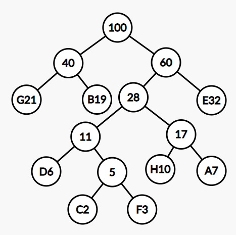
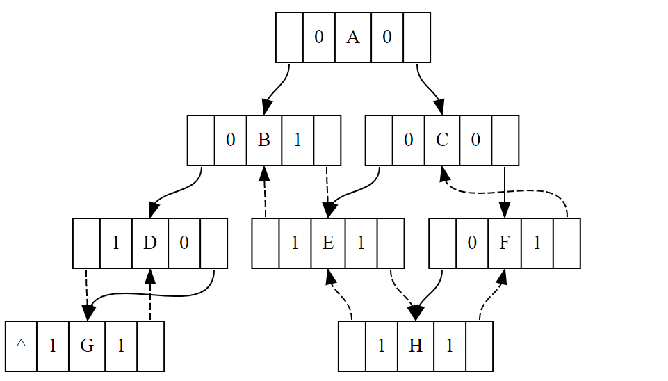
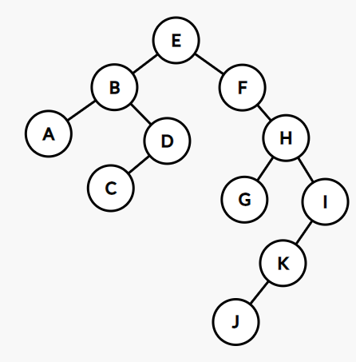
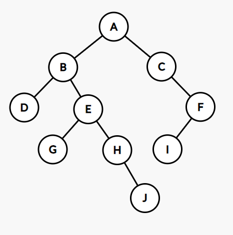

# 第六章作业
> 班级：生科登峰1901班
>
> 姓名：吴思承

## 第一次作业
### 6.8
证明：
设这颗满k叉树的深度为$m$，则可以得到$n_0$与$n_1$与$m$的关系有：
$$
\begin{aligned}
n_0 &= k^{m-1} \\
n_1 &= \sum^{m-1}_{i=1} k^{i-1} \\
&= \sum^{m-2}_{i=0} k^{i}
\end{aligned}
$$
由等比数列求和可以推出：
$$
(k-1)n_1 = k^{m-1} - 1 = n_0 - 1
$$
即
$$
n_0 = (k-1)n_1 + 1
$$

证毕。

### 6.26
记八个字母为A~H，构建Huffman树：



得到Huffman编码：

- A：1011
- B：01
- C：10010
- D：1000
- E：11
- F：10011
- G：00
- H：1010

与A—H分别对应000—111的编码（下称为“三位编码”）相比，Huffman编码的优势有：（1）对于长度为$n$的字母串，使用Huffman编码的期望长度为$2.61n$，而三位编码的期望长度为$3n$，Huffman编码相对更短；（2）Huffman编码为前缀码，8个字母编码互不为前缀，不需要间隔符号便可以读出。

而三位编码的优势在于：（1）三位编码的数值可以与字母出现频次无关，可以随意指派或使编码与字典序对应；（2）每一个字母固定对应3个二进制位，长度固定；（3）同样不需要间隔符号便可以读出。

### 6.49
#### 思路
观察完全二叉树，注意到使用BFS（层次遍历）访问完全二叉树时，若遇到一个节点不同时具有左右子树，则其后访问到的所有结点均是叶子节点。利用这一特性进行判断。

#### 关键代码
方便起见，此处使用C++ STL中的std::queue类。
```C++
bool treeCheck(BiTree T) {
    bool flag = false;
    queue<BiTree> Q;
    Q.push(T);
    while (!Q.empty()) {
        BiTree cur = Q.front();
        Q.pop();
        if (flag) {                  //先前遇到过不同时具有左右子树的结点
            if (cur->LC != NULL || cur->RC != NULL)
                return false;        //不是叶子节点，则整棵树不是完全二叉树
        }
        else {                       //访问过的结点均有左右子树
            if (cur->LC != NULL) {
                Q.push(cur->LC);
                if (cur->RC == NULL) flag = true;        //只有左子树
                else Q.push(cur->RC);                    //左右子树均存在
            }
            else if (cur->RC != NULL) return false;      //只有右子树
            else flag = true;        //没有子树
        }
    }
    return true;                     //没有问题，是完全二叉树
}
```

### 6.65
#### 思路
对于一个子树，其前序遍历序列中第一个元素必然是根节点。在中序遍历的序列中找到根节点的位置，根节点前的字串为左子树的中序遍历，根节点后的字串是右子树的中序遍历。利用左右子树中序遍历序列的长度，也可以得到左右子树前序遍历的长度。

因此只要有前序遍历和中序遍历的序列，便可以得到当前子树的根节点，以及根节点的左右子树的前序、中序遍历序列。递归构建二叉链表即可。

#### 关键代码
```C++
BiTree treeBuild(char *DLR, char *LDR) {
    int len = strlen(DLR);
    if (len == 0) return NULL;
    BiTree p = (BiTree) malloc(sizeof(TNode));
    p->tag = DLR[0];                      //先序遍历的第一个元素是根节点
    char LC_DLR[100], LC_LDR[100], RC_DLR[100], RC_LDR[100];
    int i = 1, j = 0, k = 0;
    while (i <= len && j <= len) {        //找寻左子树的前序和中序遍历序列
        if (LDR[j] == p->tag) {
            j++;
            LC_DLR[k] = LC_LDR[k] = 0;
            k = 0;
            break;
        }
        LC_DLR[k] = DLR[i];
        LC_LDR[k] = LDR[j];
        i++; j++; k++;
    }
    while (i <= len && j <= len) {        //找寻右子树的前序和中序遍历序列
        RC_DLR[k] = DLR[i];
        RC_LDR[k] = LDR[j];
        i++; j++; k++;
    }
    p->LC = treeBuild(LC_DLR, LC_LDR);    //构建左子树
    p->RC = treeBuild(RC_DLR, RC_LDR);    //构建右子树
    return p;
}
```

## 第二次作业
### 6.15
如图所示：



### 6.27
如图所示：



### 6.43
#### 思路
递归，对每个结点都交换左右子树。

#### 关键代码
```C++
Status treeInverse(BiTree T) {
    if (T->LC != NULL) treeInverse(T->LC);    //处理左子树
    if (T->RC != NULL) treeInverse(T->RC);    //处理右子树
    BiTree tmp = T->LC;                       //交换左右子树
    T->LC = T->RC;
    T->RC = tmp;
    return OK;
}
```

### 6.45
#### 思路
若元素值为x就递归删除子树，否则继续递归寻找x。

#### 关键代码
```C++
Status treeNodeDelete(BiTree T) {                //递归删除整个子树
    if (T->LC != NULL) treeNodeDelete(T->LC);    //删除左子树
    if (T->RC != NULL) treeNodeDelete(T->RC);    //删除右子树
    free(T);                                     //释放当前结点
    return OK;
}

bool treeDelete(BiTree T, int x) {               //返回值为T结点是否被删除
    if (T->tag == x) {                           //递归删除T子树
        treeNodeDelete(T);
        return true;
    }
    if (T->LC != NULL && treeDelete(T->LC, x)) T->LC = NULL;    //递归检查左子树
    if (T->RC != NULL && treeDelete(T->RC, x)) T->RC = NULL;    //递归检查右子树
    return false;
}
```

## 第三次作业
### 6.16
| | Info | Ltag | Lchild | Rtag | Rchild |
| --- | --- | --- | --- | --- | --- |
| 1 | A | 0 | 2 | 0 | 3 |
| 2 | B | 0 | 4 | 0 | 5 |
| 3 | C | 0 | 6 | 1 | 6 |
| 4 | D | 1 | 2 | 1 | 5 |
| 5 | E | 0 | 7 | 0 | 8 |
| 6 | F | 1 | 3 | 0 | 9 |
| 7 | G | 0 | 10 | 0 | 11 |
| 8 | H | 1 | 14 | 1 | 3 |
| 9 | I | 0 | 12 | 1 | 12 |
| 10 | J | 0 | 13 | 1 | 13 |
| 11 | K | 1 | 13 | 1 | 14 |
| 12 | L | 1 | 9 | 1 | 0 |
| 13 | M | 1 | 10 | 1 | 11 |
| 14 | N | 1 | 11 | 1 | 8 |

### 6.29
如图所示：



### 6.44
#### 思路
分开写两个函数，一个负责求任意子树深度，一个用来找值为x的结点。二者都用递归算法写。

#### 关键代码
使用了C++的std::max函数。
```C++
int treeDepth(BiTree T) {                //计算子树深度
    if (T == NULL) return 0;
    return max(treeDepth(T->LC), treeDepth(T->RC)) + 1;
}

Status treeSearch(BiTree T, int x) {     //寻找要计算深度的子树
    if (T->tag == x)
        printf("Depth of subtree is: %d\n", treeDepth(T));
    if (T->LC != NULL) treeSearch(T->LC, x);
    if (T->RC != NULL) treeSearch(T->RC, x);
    return OK;
}
```

### 6.47
#### 思路
维护一个接下来要访问的结点的队列即可。

#### 关键代码
使用了C++的std::queue类。
```C++
Status BFS(BiTree T) {
    queue<BiTree> Q;
    Q.push(T);
    while (!Q.empty()) {
        BiTree cur = Q.front();
        Q.pop();
        printf("%d ", cur->tag);
        if (cur->LC != NULL) Q.push(cur->LC);
        if (cur->RC != NULL) Q.push(cur->RC);
    }
    printf("\n");
    return OK;
}
```