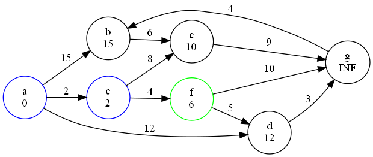
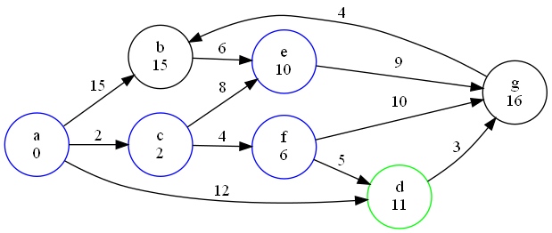

# 第七章作业
> 班级：生科登峰1901班
>
> 姓名：吴思承

## 7.1
### （1）每个顶点的入/出度
| 结点 | 入度 | 出度 |
| --- | --- | --- |
| 1 | 3 | 0 |
| 2 | 2 | 2 |
| 3 | 1 | 2 |
| 4 | 1 | 3 |
| 5 | 2 | 1 |
| 6 | 2 | 3 |

### （2）邻接矩阵
$$
\begin{array}{c|cccccc}
	出\backslash入 & 1 & 2 & 3 & 4 & 5 & 6 \\
    \hline 1 & 0 & 0 & 0 & 0 & 0 & 0 \\
    2 & 1 & 0 & 0 & 1 & 0 & 0 \\
    3 & 0 & 1 & 0 & 0 & 0 & 1 \\
    4 & 0 & 0 & 1 & 0 & 1 & 1 \\
    5 & 1 & 0 & 0 & 0 & 0 & 0 \\
    6 & 1 & 1 & 0 & 0 & 1 & 0 \\
\end{array}
$$

### （3）邻接表


### （4）逆邻接表


### （5）强连通分量
图中存在三个强连通分量，包含的点分别为：
- 1
- 5
- 2、3、4、6

## 7.3
邻接多重表如图所示：


深度优先遍历该图得到的顶点序列为：$1-2-3-4-5-6$

广度优先遍历该图得到的顶点序列为：$1-2-4-5-3-6$

## 7.7
### （1）
邻接矩阵如下：
$$
\begin{array}{c|cccccccc}
	节点 & a & b & c & d & e & f & g & h \\
    \hline a & 0 & 4 & 3 & 0 & 0 & 0 & 0 & 0 \\
    b & 4 & 0 & 5 & 5 & 9 & 0 & 0 & 0 \\
    c & 3 & 5 & 0 & 5 & 0 & 0 & 0 & 5 \\
    d & 0 & 5 & 5 & 0 & 7 & 6 & 5 & 4 \\
    e & 0 & 9 & 0 & 7 & 0 & 3 & 0 & 0 \\
    f & 0 & 0 & 0 & 6 & 3 & 0 & 2 & 0 \\
    g & 0 & 0 & 0 & 5 & 0 & 2 & 0 & 6 \\
    h & 0 & 0 & 5 & 4 & 0 & 0 & 6 & 0 \\
\end{array}
$$

按照Prim算法得到的最小生成树如图所示：


### （2）
邻接表如图所示：


按照Kruskal算法得到的最小生成树如图所示（也有可能得到前面Prim版本的生成树）：


## 7.10
各活动弧的$e$和$l$：
| 活动弧 | $e$ | $l$ |
| --- | --- | --- |
| $\alpha-A$ | 0 | 19 |
| $\alpha-B$ | 0 | 18 |
| $\alpha-D$ | 0 | 16 |
| $\alpha-F$ | 0 | 4 |
| $\alpha-G$ | 0 | 0 |
| $\alpha-I$ | 0 | 6 |
| $A-C$ | 1 | 20 |
| $B-C$ | 6 | 24 |
| $D-C$ | 3 | 19 |
| $D-E$ | 3 | 26 |
| $D-J$ | 3 | 25 |
| $F-E$ | 4 | 23 |
| $F-H$ | 4 | 8 |
| $G-H$ | 3 | 3 |
| $G-\omega$ | 3 | 23 |
| $I-H$ | 1 | 7 |
| $C-E$ | 17 | 26 |
| $E-\omega$ | 34 | 34 |
| $J-E$ | 31 | 31 |
| $J-\omega$ | 31 | 32 |
| $H-C$ | 13 | 22 |
| $H-J$ | 13 | 27 |
| $H-K$ | 13 | 13 |
| $K-J$ | 22 | 22 |

各事件的$ve$、$vl$：
| 事件 | $ve$ | $vl$ |
| --- | --- | --- |
| $\alpha$ | 0 | 0 |
| $A$ | 1 | 20 |
| $B$ | 6 | 24 |
| $D$ | 3 | 19 |
| $F$ | 4 | 8 |
| $G$ | 3 | 3 |
| $I$ | 1 | 7 |
| $C$ | 17 | 26 |
| $E$ | 34 | 34 |
| $J$ | 31 | 31 |
| $H$ | 13 | 13 |
| $K$ | 22 | 22 |
| $\omega$ | 44 | 44 |

存在一条关键路径：$\alpha-G-H-K-J-E-\omega$。

## 7.11
初始状态下，选择起点a（绿色，下同），对a连向的点进行更新：


b、c、d的距离分别被更新为5、2、12。a被标记为已选择过的点（蓝色，下同），从未被选择过的点中选择c点进行下一次更新：


e、f的距离分别被更新为10、6。c被标记为已选择过的点，从未被选择过的点中选择f点进行下一次更新：



d、g的距离分别被更新为11、16。f被标记为已选择过的点，从未被选择过的点中选择e点进行下一次更新：


e点未能更新任何点的距离。e被标记为已选择的点，从未被选择过的点中选择d点进行下一次更新：



g的距离被更新为14。d被标记为已选择的点，从未被选择过的点中选择g进行下一次更新：


g点未能更新任何点的距离。g被标记为已选择的点，从未被选择过的点中选择b进行下一次更新：


b点未能更新任何点的距离。b被标记为已选择的点，至此所有点均被选择过，Dijkstra算法结束：


a点到b~g点的最短路径分别长15、2、11、10、6、14。

## 7.22
### 思路
先实现一个邻接表和对应的初始化、加边操作。然后在上面进行一个$v_i$为起点的BFS，看能不能访问到$v_j$，只要能访问到就证明图上存在$v_i$到$v_j$的路径。

### 代码
```C++
#include <iostream>
#include <cstdlib>
#include <cstdio>
#include <algorithm>
#include <queue>

#define OK 1
#define ERROR 0
#define INFEASIBLE -1
#define OVERFLOW -2

typedef int Status;

using namespace std;

typedef struct GNode {			//邻接表的结点
	int to;
	GNode *next;
} *AdjLink;

#define GRAPH_V_SIZE 100

struct Graph {					//图
	int vsize, esize;
	AdjLink *node;
	bool *visit;
};

Status graphInit(Graph &G) {	//图的初始化
	G.vsize = GRAPH_V_SIZE;
	G.esize = 0;
	G.node = (AdjLink*) malloc(GRAPH_V_SIZE * sizeof(AdjLink));
	G.visit = (bool*) malloc(GRAPH_V_SIZE * sizeof(bool));
	if (G.node == NULL || G.visit == NULL) return OVERFLOW;
	for (int i = 0; i < GRAPH_V_SIZE; i++) {
		G.node[i] = (GNode*) malloc(sizeof(GNode));
		if (G.node[i] == NULL) return OVERFLOW;
		G.node[i]->next = NULL;
		G.visit[i] = false;
	}
	return OK;
}

Status graphAddEdge(Graph &G, int vf, int vt) {	//向图中添加有向边
	if (vf >= G.vsize || vt >= G.vsize) return ERROR;
	GNode *p = (GNode*) malloc(sizeof(GNode));
	p->next = G.node[vf]->next;
	G.node[vf]->next = p;
	p->to = vt;
	G.esize++;
	return OK;
}

bool graphFindPath(Graph G, int vf, int vt) {	//使用BFS寻找vf到vt的路径
	queue<int> Q;
	Q.push(vf);
	while (!Q.empty()) {
		int vc = Q.front();
		Q.pop();
		if (G.visit[vc]) continue;
		else G.visit[vc] = true;
		if (vc == vt) return true;		//找到路径
		for (GNode *p = G.node[vc]->next; p != NULL; p = p->next)
			if (!G.visit[p->to]) Q.push(p->to);
	}
	return false;						//没找到路径
}

int main() {
	Graph G;
	int e, v1, v2;
	graphInit(G);
	printf("Input the number of edges: \n");
	scanf("%d", &e);
	printf("Input the edges: \n");
	for (int i = 0; i < e; i++) {
		int f, t;
		scanf("%d%d", &f, &t);
		graphAddEdge(G, f, t);
	}
	printf("Input v_i and v_j: \n");
	scanf("%d%d", &v1, &v2);

	if (graphFindPath(G, v1, v2)) printf("PATH FOUND! \n");
	else printf("PATH NOT FOUND! \n");
	return 0;
}
```

## 7.42
### 思路
就是正常的Dijkstra算法，思路和教材上一致。邻接表的实现方法和上一题一致，``GNode``中多增加一个``weight``用于储存边的值。

### 代码
```C++
#define INF ~0u>>1		//定义4 byte有符号整数的上限为INF，即无穷大

Status graphDijkstra(Graph G, int vs, int* result) {
	for (int i = 0; i < G.vsize; i++) result[i] = INF;	//初始化
	result[vs] = 0;
	for (int i = 0; i < G.vsize; i++) {
		int vc = -1, dmin = INF;
		for (int j = 0; j < G.vsize; j++) {		//寻找更新的起点
			if (G.visit[j]) continue;
			if (result[j] < dmin) {
				dmin = result[j];
				vc = j;
			}
		}
		if (dmin == INF) break;					//当前的联通子图已经访问完了
		G.visit[vc] = true;						//标记
		for (GNode *p = G.node[vc]->next; p != NULL; p = p->next)	//更新
			result[p->to] = min(result[p->to], result[vc] + p->weight);
	}
	return OK;
}
```