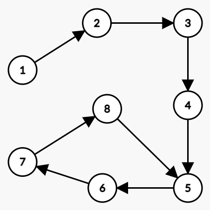
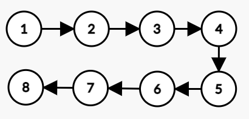
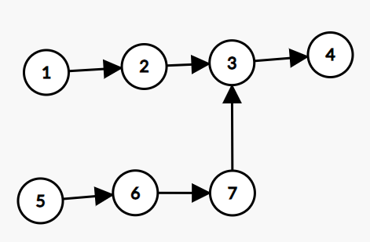
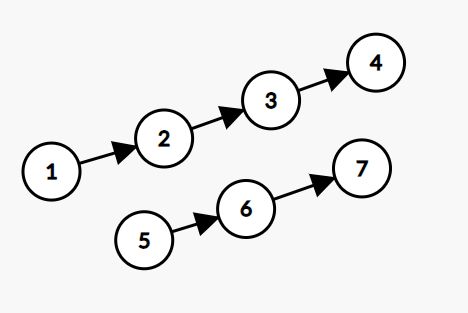

# 3月30日上机报告
> 班级：生科登峰1901班
> 姓名：吴思承

## 顺序表上机题
### 0. 对于有序顺序表，去除重复数据
#### 关键代码
```C
struct SqList {
    int *elem;
    int length;
    int listsize;
};

Status listDelete(SqList &L, int pos) {
    if (pos >= L.length || pos < 0) return ERROR;
    for (int i = pos + 1; i < L.length; i++)
        L.elem[i - 1] = L.elem[i];
    L.length--;
    return OK;
}

int main() {
    ……
    
    int i = 0;
    while (i < L.length - 1) {
        if (L.elem[i] == L.elem[i + 1])
            listDelete(L, i + 1);
        else i++;
    }

    ……
}
```

#### 运行结果
```
Input the number of elements:
7
Input the elements:
1 1 4 5 14 19 19
Results:
1 4 5 14 19
```

### 1. 排除所有0元素
#### 关键代码
```C
struct SqList {
    int *elem;
    int length;
    int listsize;
};

Status listDelete(SqList &L, int pos) {
    if (pos >= L.length || pos < 0) return ERROR;
    for (int i = pos + 1; i < L.length; i++)
        L.elem[i - 1] = L.elem[i];
    L.length--;
    return OK;
}

int main() {
    ……
    
    int i = 0;
    while (i < L.length) {
        if (L.elem[i] == 0)
            listDelete(L, i);
        else i++;
    }

    ……
}
```

#### 运行结果
```
Input the number of elements:
8
Input the elements:
2 0 0 3 1 0 0 4
Results:
2 3 1 4
```

### 2. 三个基本排序算法
#### 关键代码
```C
Status bubbleSort(SqList &L) {          //冒泡排序
    for (int i = 0; i < L.length - 1; i++) {
        bool flag = false;
        for (int j = 0; j < L.length - i - 1; j++) {
            if (L.elem[j] > L.elem[j + 1]) {
                int tmp = L.elem[j + 1];
                L.elem[j + 1] = L.elem[j];
                L.elem[j] = tmp;
                flag = true;
            }
        }
        if (!flag) break;
    }
    return OK;
}

Status insertSort(SqList &L) {          //插入排序
    for (int i = 0; i < L.length - 1; i++) {
        int maxv = ~0u>>1, maxp;
        for (int j = i; j < L.length; j++) {
            if (L.elem[j] < maxv) {
                maxv = L.elem[j];
                maxp = j;
            } 
        }
        for (int j = maxp - 1; j >= i; j--)
            L.elem[j + 1] = L.elem[j];
        L.elem[i] = maxv;
    }
    return OK;
}

Status selectSort(SqList &L) {          //选择排序
    for (int i = 0; i < L.length - 1; i++) {
        int maxv = ~0u>>1, maxp;
        for (int j = i; j < L.length; j++) {
            if (L.elem[j] < maxv) {
                maxv = L.elem[j];
                maxp = j;
            } 
        }
        L.elem[maxp] = L.elem[i];
        L.elem[i] = maxv;
    }
    return OK;
}
```

#### 运行结果（三者皆一致）
```
Input the number of elements:
9
Input the elements:
20 15 11 1 9 20 5 9 15
Results:
1 5 9 9 11 15 15 20 20
```

### 3. 模式匹配问题
#### 关键代码
```C
struct SqList {
    int *elem;
    int length;
    int listsize;
};

Status listInit(SqList &L) {
    L.elem = (int *) malloc(LIST_INIT_SIZE * sizeof(int));
    if (L.elem == NULL) return OVERFLOW;
    L.length = 0;
    L.listsize = LIST_INIT_SIZE;
    return OK;
}

Status listInsert(SqList &L, int data) {
    if (L.length == L.listsize) {
        L.listsize += LISTINCREMENT;
        L.elem = (int *) realloc(L.elem, L.listsize * sizeof(int));
        if (L.elem == NULL) return OVERFLOW;
    }
    L.elem[L.length++] = data;
    return OK;
}

Status makeNext(SqList T, SqList &N) {
    listInsert(N, -1);
    int i = 1, j = -1;
    while (i < T.length) {
        if (j == -1 || T.elem[i] == T.elem[j]) {
            i++; j++;
            listInsert(N, j);
        }
        else j = N.elem[j];
    }
    return OK;
}

int KMP(SqList A, SqList B, int pos = 0) {
    SqList N;
    listInit(N);
    makeNext(B, N);
    int i = pos, j = 0;
    while (i < A.length) {
        if (A.elem[i] == B.elem[j]) i++, j++;
        else j = N.elem[j];
        if (j == B.length) return i - B.length;
        if (j == -1) i++, j++;
    }
    return -1;
}
```

#### 运行结果
失配情形下：
```
Input the number of elements in A:
6
Input the elements in A:
1 1 4 5 1 4
Input the number of elements in B:
2
Input the elements in B:
1 5
B not found in A
```

匹配情形下：
```
Input the number of elements in A:
6
Input the elements in A:
1 1 4 5 1 4
Input the number of elements in B:
2
Input the elements in B:
5 1
First B found in A at: 3
```

## 单链表上机题
### 0. 将单链表逆置，要求不改变结点地址
#### 关键代码
```C
typedef struct LNode {
    int data;
    LNode *next;
} *LinkList;

Status listReverse(LinkList &L) {
    LNode *p = L;
    while (p->next != NULL) p = p->next;
    while (L->next != p) {
        LNode *q = L->next;
        L->next = q->next;
        q->next = p->next;
        p->next = q;
    }
    return OK;
}
```

#### 运行结果
```
Input the number of elements:
9
Input the elements:
20 15 11 1 9 20 5 9 15
Results:
15 9 5 20 9 1 11 15 20
```

### 1. 找单链表中点
#### 关键代码
```C
typedef struct LNode {
    int data;
    LNode *next;
} *LinkList;

Status listFind(LinkList L, int k, int &res) {
    LNode *p = L;
    for (int i = 1; i <= k; i++) {
        p = p->next;
        if (p == NULL) return INFEASIBLE;
    }
    res = p->data;
    return OK;
}

int listLength(LinkList L) {
    LNode *p = L->next;
    int length = 0;
    while (p != NULL) {
        length++;
        p = p->next;
    }
    return length;
}

int main() {
    ……

    int length = listLength(L);
    if (length % 2) {
        int mid;
        listFind(L, length / 2 + 1, mid);
        printf("Midpoint is: %d\n", mid);
    }
    else printf("Midpoint not found: even length\n");
    return 0;
}
```

#### 运行结果
找到中点（奇数长度）：
```
Input the number of elements:
9
Input the elements:
20 15 11 1 9 20 5 9 15
Midpoint is: 9
```

找不到中点（偶数长度）：
```
Input the number of elements:
6
Input the elements:
1 1 4 5 1 4
Midpoint not found: even length
```

### 2. 找单链表倒数第K个点
#### 关键代码
```C
typedef struct LNode {
    int data;
    LNode *next;
} *LinkList;

Status listFind(LinkList L, int k, int &res) {
    LNode *p = L;
    for (int i = 1; i <= k; i++) {
        p = p->next;
        if (p == NULL) return INFEASIBLE;
    }
    res = p->data;
    return OK;
}

Status listReverse(LinkList &L) {
    LNode *p = L;
    while (p->next != NULL) p = p->next;
    while (L->next != p) {
        LNode *q = L->next;
        L->next = q->next;
        q->next = p->next;
        p->next = q;
    }
    return OK;
}

int main() {
    ……
    
    listReverse(L);
    int res;
    if (listFind(L, k, res) == INFEASIBLE) printf("ERROR: OVERFLOW!\n");
    else printf("Result: %d\n", res);
    listReverse(L);
    return 0;
}
```

#### 运行结果
```
Input the number of elements:
6
Input the elements:
9 2 3 1 7 3
Input number k:
4
Result: 3
```

### 3. 删除单链表倒数第K个点
#### 关键代码
```C
typedef struct LNode {
    int data;
    LNode *next;
} *LinkList;

Status listDelete(LinkList L, int k) {
    LNode *p = L;
    for (int i = 1; i < k; i++) {
        if (p->next == NULL) return INFEASIBLE;
        p = p->next;
    }
    LNode *q = p->next;
    p->next = q->next;
    free(q);
    return OK;
}

Status listReverse(LinkList &L) {
    LNode *p = L;
    while (p->next != NULL) p = p->next;
    while (L->next != p) {
        LNode *q = L->next;
        L->next = q->next;
        q->next = p->next;
        p->next = q;
    }
    return OK;
}

int main() {
    ……

    listReverse(L);
    if (listDelete(L, k) == INFEASIBLE) printf("ERROR: OVERFLOW!\n");
    else printf("DELETE SUCCESS\n");
    listReverse(L);
    
    ……
}
```

#### 运行结果
```
Input the number of elements:
6
Input the elements:
9 2 3 1 7 3
Input number k:
4
DELETE SUCCESS
9 2 1 7 3
```

### 4. 判断单链表是否有环，如有，找出交点
为了录入数据方便，此处使用模拟链表，只输入节点位置和节点的后继位置。
#### 关键代码
```C
int nxt[100];

int listLength(int L) {
    int p = L;
    int length = 0;
    while (p != -1) {
        length++;
        p = nxt[p];
    }
    return length;
}

int main() {
    int n, L;
    printf("Input the number of nodes: \n");
    scanf("%d", &n);
    printf("Input POSITION and NEXT of each node: \n");
    for (int i = 0; i < n; i++) {
        int p, nx;
        scanf("%d%d", &p, &nx);
        nxt[p] = nx;
    }
    printf("Input the head of linklist: \n");
    scanf("%d", &L);
    
    int i, j;
    bool flag = false;
    i = j = L;

    while(j != -1) {
        i = nxt[i];
        if (nxt[j] != -1) j = nxt[nxt[j]];
        else break;
        if (i == j) {
            flag = true;
            break;
        }
    }

    if (flag) {
        i = L;
        while (i != j) {
            i = nxt[i];
            j = nxt[j];
        }
        printf("Loop starting from: %d\n", i);
    }
    else printf("LOOP NOT FOUND!\n");
    return 0;
}
```

#### 运行结果
有环的情形：



```
1 2
2 3
3 4
4 5
5 6
6 7
7 8
8 5
Input the head of linklist:
1
Loop starting from: 5
```

无环的情形：



```
Input the number of nodes:
8
Input POSITION and NEXT of each node:
1 2
2 3
3 4
4 5
5 6
6 7
7 8
8 -1
Input the head of linklist:
1
LOOP NOT FOUND!
```

### 5. 判断两个单链表是否相交，如果相交，找出交点
输入情况同上。
#### 关键代码
```C
int nxt[100];

int listLength(int L) {
    int p = L;
    int length = 0;
    while (p != -1) {
        length++;
        p = nxt[p];
    }
    return length;
}

int main() {
    int n, L1, L2;
    printf("Input the number of nodes: \n");
    scanf("%d", &n);
    printf("Input POSITION and NEXT of each node: \n");
    for (int i = 0; i < n; i++) {
        int p, nx;
        scanf("%d%d", &p, &nx);
        nxt[p] = nx;
    }
    printf("Input the head of linklist 1 & 2: \n");
    scanf("%d%d", &L1, &L2);
    
    int len1, len2;
    len1 = listLength(L1);
    len2 = listLength(L2);
    
    int i = L1, j = L2;
    while (len1 > len2) {
        i = nxt[i];
        len1--;
    }
    while (len1 < len2) {
        j = nxt[j];
        len2--;
    }
    while (i != j) {
        i = nxt[i];
        j = nxt[j];
    }
    
    if (i == -1) printf("No junction!\n");
    else printf("Junction at pos: %d\n", i);
    return 0;
}
```

#### 运行结果
相交的情形：



```
Input the number of nodes:
7
Input POSITION and NEXT of each node:
1 2
2 3
3 4
4 -1
5 6
6 7
7 3
Input the head of linklist 1 & 2:
1 5
Junction at pos: 3
```

不相交的情形：



```
Input the number of nodes:
7
Input POSITION and NEXT of each node:
1 2
2 3
3 4
4 -1
5 6
6 7
7 -1
Input the head of linklist 1 & 2:
1 5
No junction!
```

### 6. 对于有序单链表，删除重复节点
#### 保留一个
##### 关键代码
```C
Status listUnique(LinkList &L) {
    LNode *p = L->next;
    while(p->next != NULL) {
        if (p->data == p->next->data) {
            LNode *q = p->next;
            p->next = q->next;
            free(q);
        }
        else p = p->next;
    }
    return OK;
}
```

##### 运行结果
```
Input the number of elements:
7
Input the elements:
1 1 4 5 14 19 19
Results:
1 4 5 14 19
```

#### 不保留
##### 关键代码
```C
Status listUnique(LinkList &L) {
    LNode *p = L;
    bool flag = false;
    while(p->next != NULL) {
        if (p->next->next == NULL || p->next->data != p->next->next->data) {
            if (flag) {
                LNode *q = p->next;
                p->next = q->next;
                free(q);
                flag = false;
            }
            else p = p->next;
        }
        else {
            flag = true;
            LNode *q = p->next->next;
            p->next->next = q->next;
            free(q);
        }
    }
    return OK;
}
```

##### 运行结果
```
Input the number of elements:
7
Input the elements:
1 1 4 5 14 19 19
Results:
4 5 14
```

### 7. 约瑟夫问题
#### 关键代码
##### 无损
```C
typedef struct LNode {
    int data;
    bool flag;
    LNode *next;
} *LinkList;

int main() {
    ……

    printf("Results: \n");
    LNode *p = L;
    for (int i = 1; i <= n; i++) {
        for (int j = 1; j <= m; j++) {
            do {
                p = p->next;
            }
            while (p->flag);
        }
        printf ("%d OUT\n", p->data);
        p->flag = true;
    }
    return 0;
}
```

##### 有损
```C
typedef struct LNode {
    int data;
    LNode *next;
} *LinkList;

int main() {
    ……
    
    printf("Results: \n");
    LNode *p = L;
    for (int i = 1; i <= n; i++) {
        for (int j = 1; j < m; j++) p = p->next;
        printf ("%d OUT\n", p->next->data);
        LNode *q = p->next;
        if (p->next != p) p->next = q->next;
        else L->next = NULL;
        free(q);
    }
    return 0;
}
```

#### 运行结果（二者一致）
```
Input number n and m:
6 5
Results:
5 OUT
4 OUT
6 OUT
2 OUT
3 OUT
1 OUT
```

### 8. 合并两个升序单链表(保留重复点)，合并后为升序
#### 关键代码
```C
LinkList linkMerge(LinkList A, LinkList B) {
    LNode *p = A, *q = B->next;
    while (q != NULL) {
        while (p->next != NULL && p->next->data <= q->data)
            p = p->next;
        B->next = q->next;
        q->next = p->next;
        p->next = q;
        q = B->next;
    }
    free(B);
    return A;
}

int main() {
    ……

    L1 = linkMerge(L1, L2);

    ……
}
```

#### 运行结果
```
Input the number of elements in A and B:
7 5
Input the elements of A:
1 1 4 5 14 19 19
Input the elements of B:
1 3 5 7 9
Results:
1 1 1 3 4 5 5 7 9 14 19 19
```

### 9. 合并两个升序单链表(保留重复点)，合并后为降序
实际上就是在前面的代码上加一个原地逆置。
#### 关键代码
```C
LinkList linkMerge(LinkList A, LinkList B) {
    LNode *p = A, *q = B->next;
    while (q != NULL) {
        while (p->next != NULL && p->next->data <= q->data)
            p = p->next;
        B->next = q->next;
        q->next = p->next;
        p->next = q;
        q = B->next;
    }
    free(B);
    return A;
}

int main() {
    ……

    L1 = linkMerge(L1, L2);
	listReverse(L1);

    ……
}
```

#### 运行结果
```
Input the number of elements in A and B:
7 5
Input the elements of A:
1 1 4 5 14 19 19
Input the elements of B:
1 3 5 7 9
Results:
19 19 14 9 7 5 5 4 3 1 1 1
```

### 10. 判断一个单链表是否对称
#### 关键代码
```C
typedef struct LNode {
	int data;
	LNode *next;
} *LinkList;

Status listInsert(LinkList &L, int data) {
	LNode *p = (LNode *) malloc(sizeof(LNode));
	if (p == NULL) return OVERFLOW;
	p->next = L->next;
	p->data = data;
	L->next = p;
	return OK;
}

Status listReverse(LinkList &L) {
	LNode *p = L;
	while (p->next != NULL) p = p->next;
	while (L->next != p) {
		LNode *q = L->next;
		L->next = q->next;
		q->next = p->next;
		p->next = q;
	}
	return OK;
}

bool listCheck(LinkList L1, LinkList L2) {
	LNode *p = L1->next, *q = L2->next;
	while (p != NULL && q != NULL) {
		if (p->data != q->data) return false;
		p = p->next;
		q = q->next;
	}
	return true;
}

int main() {
    ……

	for (LNode *p = L->next; p != NULL; p = p->next)
		listInsert(M, p->data);

	if (listCheck(L, M)) printf("IS SYMMETRIC\n");
	else printf("NOT SYMMETRIC\n");
	return 0;
}
```

#### 运行结果
不对称的情形：
```
Input the number of elements:
6
Input the elements:
1 1 4 5 1 4
NOT SYMMETRIC
```

对称的情形：
```
Input the number of elements:
6
Input the elements:
1 1 5 5 1 1
IS SYMMETRIC
```