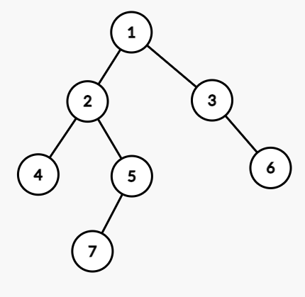
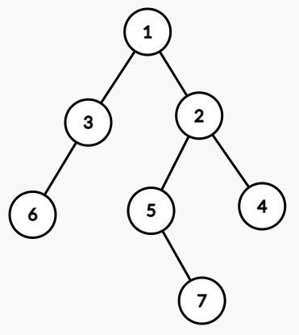

# 4月6日上机报告
> 班级：生科登峰1901班
> 姓名：吴思承

## 测试用二叉树
所有的测试数据均使用如图所示的二叉树：



## 0. 
- 递归方法建立二叉树；
- 非递归方法前序遍历二叉树；
- 递归方法前序、中序、后序遍历二叉树
方便起见使用了C++ STL中的std::stack类。

### 关键代码
```C++
typedef struct TNode {
	int tag;
	TNode *LC, *RC;
} *BiTree;

BiTree treeBuild() {
	int id;
	scanf("%d", &id);
	if (id == 0) return NULL;
	BiTree p = (BiTree) malloc(sizeof(TNode));
	p->tag = id;
	p->LC = treeBuild();
	p->RC = treeBuild();
	return p;
}

Status DLR_NR(BiTree T) {
	stack<BiTree> S;
	S.push(T);
	while (!S.empty()) {
		BiTree cur = S.top();
		S.pop();
		printf("%d ", cur->tag);
		if (cur->RC != NULL) S.push(cur->RC);
		if (cur->LC != NULL) S.push(cur->LC);
	}
	printf("\n");
	return OK;
}

Status DLR(BiTree T) {
	printf("%d ", T->tag);
	if (T->LC != NULL) DLR(T->LC);
	if (T->RC != NULL) DLR(T->RC);
	return OK;
}

Status LDR(BiTree T) {
	if (T->LC != NULL) LDR(T->LC);
	printf("%d ", T->tag);
	if (T->RC != NULL) LDR(T->RC);
	return OK;
}

Status LRD(BiTree T) {
	if (T->LC != NULL) LRD(T->LC);
	if (T->RC != NULL) LRD(T->RC);
	printf("%d ", T->tag);
	return OK;
}
```

### 运行结果
```
Describe the binary tree:
1 2 4 0 0 5 7 0 0 0 3 0 6 0 0
Non-recursive DLR traversal:
1 2 4 5 7 3 6
Recursive DLR traversal:
1 2 4 5 7 3 6
Recursive LDR traversal:
4 2 7 5 1 3 6
Recursive LRD traversal:
4 7 5 2 6 3 1
```

## 1. 将二叉树对称交换，即求二叉树镜像
### 关键代码
```C
typedef struct TNode {
	int tag;
	TNode *LC, *RC;
} *BiTree;

Status treeInverse(BiTree T) {
	if (T->LC != NULL) treeInverse(T->LC);
	if (T->RC != NULL) treeInverse(T->RC);
	BiTree tmp = T->LC;
	T->LC = T->RC;
	T->RC = tmp;
	return OK;
}
```

### 运行结果
```
Describe the binary tree:
1 2 4 0 0 5 7 0 0 0 3 0 6 0 0
Result:
1 3 6 ^ ^ ^ 2 5 ^ 7 ^ ^ 4 ^ ^
```
反转后的树即为：



## 2. 求二叉树的高度，即深度
### 关键代码
```C
typedef struct TNode {
	int tag;
	TNode *LC, *RC;
} *BiTree;

int treeDepth(BiTree T) {
	if (T == NULL) return 0;
	int depL, depR;
	depL = treeDepth(T->LC);
	depR = treeDepth(T->RC);
	return max(depL, depR) + 1;
}
```

### 运行结果
```
Describe the binary tree:
1 2 4 0 0 5 7 0 0 0 3 0 6 0 0
Result: 4
```

## 3. 已知前序序列和中序序列，构造二叉树
### 关键代码
```C
typedef struct TNode {
	char tag;
	TNode *LC, *RC;
} *BiTree;

BiTree treeBuild(char *DLR, char *LDR) {
	int len = strlen(DLR);
	if (len == 0) return NULL;
	BiTree p = (BiTree) malloc(sizeof(TNode));
	p->tag = DLR[0];
	char LC_DLR[100], LC_LDR[100], RC_DLR[100], RC_LDR[100];
	int i = 1, j = 0, k = 0;
	while (i <= len && j <= len) {
		if (LDR[j] == p->tag) {
			j++;
			LC_DLR[k] = LC_LDR[k] = 0;
			k = 0;
			break;
		}
		LC_DLR[k] = DLR[i];
		LC_LDR[k] = LDR[j];
		i++; j++; k++;
	}
	while (i <= len && j <= len) {
		RC_DLR[k] = DLR[i];
		RC_LDR[k] = LDR[j];
		i++; j++; k++;
	}
	p->LC = treeBuild(LC_DLR, LC_LDR);
	p->RC = treeBuild(RC_DLR, RC_LDR);
	return p;
}
```

### 运行结果
```
Input DLR traversal and LDR traversal of the tree:
1245736
4275136
Result:
1 2 4 ^ ^ 5 7 ^ ^ ^ 3 ^ 6 ^ ^
```

## 4. 分层遍历二叉树
方便起见使用了C++ STL中的std::queue类。

### 关键代码
```C++
typedef struct TNode {
	int tag;
	TNode *LC, *RC;
} *BiTree;

Status BFS(BiTree T) {
	queue<BiTree> Q;
	Q.push(T);
	while (!Q.empty()) {
		BiTree cur = Q.front();
		Q.pop();
		printf("%d ", cur->tag);
		if (cur->LC != NULL) Q.push(cur->LC);
		if (cur->RC != NULL) Q.push(cur->RC);
	}
	printf("\n");
	return OK;
}
```

### 运行结果
```
Describe the binary tree:
1 2 4 0 0 5 7 0 0 0 3 0 6 0 0
Result:
1 2 3 4 5 6 7
```

## 5. 求二叉树的宽度
使用了二叉树的顺序存储。

### 关键代码
```C++
int BiTree[100];

Status treeWidth() {
	int cnt = 0, dep = 1, maxw = -1;
	bool flag = true;
	for (int i = 1; i < 1 << dep || flag; i++) {
		if (i == 1 << dep) {
			dep++;
			cnt = 0;
			flag = false;
		}
		if (BiTree[i] == 0) continue;
		if (BiTree[i * 2] || BiTree[i * 2 + 1]) flag = true;
		cnt++;
		maxw = max(maxw, cnt);
	}
	return maxw;
}
```

### 运行结果
```
Describe the binary tree:
1 2 4 0 0 5 7 0 0 0 3 0 6 0 0
Result: 3
```

## 6. 二叉树中的结点个数
### 关键代码
```C
typedef struct TNode {
	int tag;
	TNode *LC, *RC;
} *BiTree;

int treeSize(BiTree T) {
	if (T == NULL) return 0;
	return treeSize(T->LC) + treeSize(T->RC) + 1;
}
```

### 运行结果
```
Describe the binary tree:
1 2 4 0 0 5 7 0 0 0 3 0 6 0 0
Result: 7
```

## 7. 非递归方法中序、后序遍历二叉树
方便起见使用了C++ STL中的std::stack类。

### 关键代码
```C++
typedef struct TNode {
	int tag;
	TNode *LC, *RC;
} *BiTree;

Status LDR_NR(BiTree T) {
	stack<BiTree> S_cur, S_pre;
	S_cur.push(T);
	while (!S_cur.empty()) {
		BiTree cur = S_cur.top();
		S_cur.pop();
		if (S_pre.empty() || S_pre.top() != cur) {
			S_pre.push(cur);
			if (cur->RC != NULL) S_cur.push(cur->RC);
			S_cur.push(cur);
			if (cur->LC != NULL) S_cur.push(cur->LC);
		}
		else {
			S_pre.pop();
			printf("%d ", cur->tag);
		}
	}
	printf("\n");
	return OK;
}

Status LRD_NR(BiTree T) {
	stack<BiTree> S_cur, S_pre;
	S_cur.push(T);
	while (!S_cur.empty()) {
		BiTree cur = S_cur.top();
		S_cur.pop();
		if (S_pre.empty() || S_pre.top() != cur) {
			S_pre.push(cur);
			S_cur.push(cur);
			if (cur->RC != NULL) S_cur.push(cur->RC);
			if (cur->LC != NULL) S_cur.push(cur->LC);
		}
		else {
			S_pre.pop();
			printf("%d ", cur->tag);
		}
	}
	printf("\n");
	return OK;
}
```

### 运行结果
```
Describe the binary tree:
1 2 4 0 0 5 7 0 0 0 3 0 6 0 0
Non-recursive LDR traversal:
4 2 7 5 1 3 6
Non-recursive LRD traversal:
4 7 5 2 6 3 1
```

## 8. 求二叉树第K层的结点个数
### 关键代码
```C
typedef struct TNode {
	int tag;
	TNode *LC, *RC;
} *BiTree;

int treeCount(BiTree T, int k) {
	if (T == NULL) return 0;
	if (k == 1) return 1;
	return treeCount(T->LC, k - 1) + treeCount(T->RC, k - 1);
}
```

### 运行结果
```
Describe the binary tree:
1 2 4 0 0 5 7 0 0 0 3 0 6 0 0
Input number K:
3
Result: 3
```

## 9. 求二叉树中叶子结点的个数
### 关键代码
```C
typedef struct TNode {
	int tag;
	TNode *LC, *RC;
} *BiTree;

int leafCount(BiTree T) {
	if (T == NULL) return 0;
	if (T->LC == NULL && T->RC == NULL) return 1;
	return leafCount(T->LC) + leafCount(T->RC);
}
```

### 运行结果
```
1 2 4 0 0 5 7 0 0 0 3 0 6 0 0
Result: 3
```

## 10. 判断两棵二叉树是否结构相同
### 关键代码
```C
typedef struct TNode {
	int tag;
	TNode *LC, *RC;
} *BiTree;

bool treeCmp(BiTree T1, BiTree T2) {
	if (T1 == NULL && T2 == NULL) return true;
	if (T1 == NULL || T2 == NULL) return false;
	return treeCmp(T1->LC, T2->LC) && treeCmp(T1->RC, T2->RC);
}
```

### 运行结果
结构相同的情况下：
```
Describe the binary tree 1:
1 2 4 0 0 5 7 0 0 0 3 0 6 0 0
Describe the binary tree 2:
7 6 4 0 0 3 1 0 0 0 5 0 2 0 0
SAME STRUCTURE
```

结构不同的情况下：
```
Describe the binary tree 1:
1 2 4 0 0 5 7 0 0 0 3 0 6 0 0
Describe the binary tree 2:
1 2 4 0 0 5 0 0 3 0 0
DIFFERENT STRUCTURE
```

## 11. 求二叉树中两个结点的最低公共祖先结点
使用了二叉树的顺序存储。

### 关键代码
```C
int BiTree[100], Depth[100];

Status treeBuild(int t) {
	int id;
	scanf("%d", &id);
	BiTree[t] = id;
	if (id == 0) return OK;
	Depth[t] = Depth[t >> 1] + 1;
	treeBuild(t * 2);
	treeBuild(t * 2 + 1);
	return OK;
}

int treeFind(int tag) {
	for (int i = 1; i < 100; i++) 
		if (BiTree[i] == tag) return i;
	return -1;
}

int LCA(int A, int B) {
	int Apos = treeFind(A), Bpos = treeFind(B);
	while (Depth[Apos] != Depth[Bpos]) {
		if (Depth[Apos] > Depth[Bpos]) Apos /= 2;
		else Bpos /= 2;
	}
	while (Apos != Bpos) {
		Apos /= 2;
		Bpos /= 2;
	}
	return BiTree[Apos];
}
```

### 运行结果
```
Describe the binary tree:
1 2 4 0 0 5 7 0 0 0 3 0 6 0 0
Input A and B:
4 7
LCA of A and B is: 2
```