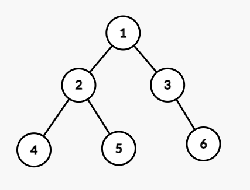
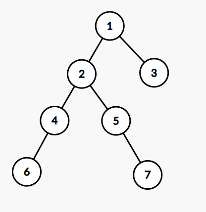
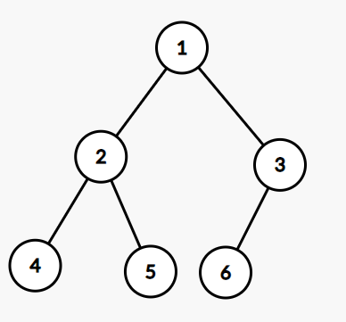

# 4月27日上机报告
> 班级：生科登峰1901班
> 姓名：吴思承

## 1. 非递归方法建立二叉树
用二重指针栈来模拟递归过程中的引用传参。为了方便起见使用了C++的std::stack类。

### 关键代码
```C++
typedef struct TNode {
	int tag;
	TNode *LC, *RC;
} *BiTree;

Status treeBuild(BiTree &T) {
	stack<BiTree*> S;
	S.push(&T);
	while(!S.empty()) {
		BiTree *cur = S.top();
		S.pop();
		int id;
		scanf("%d", &id);
		if (id == 0) *cur = NULL;
		else {
			*cur = (BiTree) malloc(sizeof(TNode));
			(*cur)->tag = id;
			S.push(&(*cur)->RC);
			S.push(&(*cur)->LC);
		}
	}
	return OK;
}
```

### 运行结果
输入的树如下：



```
Describe the binary tree:
1 2 4 0 0 5 0 0 3 0 6 0 0
Result:
1 2 4 ^ ^ 5 ^ ^ 3 ^ 6 ^ ^
```

## 2. 求二叉树中节点的最大距离
这里假定二叉树中每条边的距离都是1，不过换成有权值的边算法也是差不多的。二叉树中的任意两点间存在唯一路径，且经过两个点的最近公共祖先（LCA）。

存在这样一个结论：二叉树上最长路径的两端点离其LCA最远。

下面对其进行反证：

假设二叉树上最长路径为$A-...-LCA-...-B$，其中$LCA$为$A$和$B$的最近公共祖先。而存在与$A$处于$LCA$的同一子树内的点$C$，使得$L_{C-LCA}>L_{A-LCA}$。则显然$C-...-LCA-...-B$是比$A-...-LCA-...-B$更长的路径，与原题设不符。对$B$同样这样考虑，便可知$A$和$B$为$LCA$左右子树中离$LCA$最远的。

对于树上的每个点，左右子树的深度的和便是经过该点的最长路径。因此可以通过深度优先搜索递归遍历整棵树，一边利用左右子树的深度计算当前点的深度，一边计算经过当前点的最长路径，并更新答案。

### 关键代码
```C++
typedef struct TNode {
	int tag;
	TNode *LC, *RC;
} *BiTree;

int getMaxPath(BiTree T, int &maxl) {
	if (T == NULL) return 0;
	int lenL, lenR;
	lenL = getMaxPath(T->LC, maxl);
	lenR = getMaxPath(T->RC, maxl);
	maxl = max(maxl, lenL + lenR);
	return max(lenL, lenR) + 1;
}
```

### 运行结果
输入的树如下：



```
Describe the binary tree:
1 2 4 6 0 0 0 5 0 7 0 0 3 0 0
Result: 4
```

## 3. 判断二叉树是不是完全二叉树
广度优先搜索遍历/层次遍历完全二叉树，从第一个度不为2的结点开始，之后访问到的应均为叶子节点。此外树上也不应存在只有右子树的点。

为了方便起见使用了C++的std::queue类。

### 关键代码
```C++
typedef struct TNode {
	int tag;
	TNode *LC, *RC;
} *BiTree;

bool treeCheck(BiTree T) {
	bool flag = false;
	queue<BiTree> Q;
	Q.push(T);
	while (!Q.empty()) {
		BiTree cur = Q.front();
		Q.pop();
		if (flag) {
			if (cur->LC != NULL || cur->RC != NULL)
				return false;
		}
		else {
			if (cur->LC != NULL) {
				Q.push(cur->LC);
				if (cur->RC == NULL) flag = true;
				else Q.push(cur->RC);
			}
			else if (cur->RC != NULL) return false;
			else flag = true;
		}
	}
	return true;
}
```

### 运行结果
输入的树不是完全二叉树：


```
Describe the binary tree:
1 2 4 0 0 5 0 0 3 0 6 0 0
NOT COMPLETE!
```

输入的树是完全二叉树：



```
Describe the binary tree:
1 2 4 0 0 5 0 0 3 6 0 0 0
IS COMPLETE!
```

## 4. 将二叉查找树变为有序的双向链表
构建二叉查找树，然后进行与后序遍历顺序刚好相反的RDL遍历，一边遍历一边通过头插法建立双向链表。

### 关键代码
```C++
typedef struct TNode {
	int key;
	TNode *LC, *RC;
} *BiTree;

typedef struct LNode {
	int data;
	LNode *next, *prev;
} *LinkList;

Status linkAdd(LinkList &L, int a) {
	LNode *p = (LNode*) malloc(sizeof(LNode));
	if (p == NULL) return OVERFLOW;
	p->next = L->next;
	L->next = p;
	if (p->next != NULL) p->next->prev = p;
	p->prev = L;
	p->data = a;
	return OK;
}

Status tree2Link(BiTree T, LinkList L) {
	if (T == NULL) return OK;
	tree2Link(T->RC, L);
	linkAdd(L, T->key);
	tree2Link(T->LC, L);
	return OK;
}
```

### 运行结果
```
Input the number of nodes:
9
Input the nodes:
20 15 11 1 9 20 5 9 15
Result:
1 5 9 11 15 20
```

## 5. 判断二叉树是不是平衡二叉树
深度优先搜索，一边递归遍历求深度一边判断当前子树是否平衡。

### 关键代码
```C++
typedef struct TNode {
	int tag, depth;
	TNode *LC, *RC;
} *BiTree;

bool treeIsBalance(BiTree T) {
	int depL, depR;
	if (T->LC != NULL) {
		if (!treeIsBalance(T->LC)) return false;
		depL = T->LC->depth;
	}
	else depL = 0;
	if (T->RC != NULL) {
		if (!treeIsBalance(T->RC)) return false;
		depR = T->RC->depth;
	}
	else depR = 0;
	T->depth = max(depL, depR) + 1;
	if (depL - depR > 1 || depL - depR < -1) return false;
	else return true;
}
```

### 运行结果
输入的树是不平衡的：


```
Describe the binary tree:
1 2 4 6 0 0 0 5 0 7 0 0 3 0 0
NOT BALANCED!
```

输入的树是平衡的：


```
Describe the binary tree:
1 2 4 0 0 5 0 0 3 0 6 0 0
IS BALANCED!
```

## 6. 找出二叉查找树中出现频率最高的元素
在向查找树中增加结点的时候对频率进行统计，加点完毕后搜索全树找频率最大的结点。

### 关键代码
```C++
typedef struct TNode {
	int key, count;
	TNode *LC, *RC;
} *BiTree;

Status treeAdd(BiTree &T, int a) {
	if (T == NULL) {
		T = (BiTree) malloc(sizeof(TNode));
		if (T == NULL) return OVERFLOW;
		T->key = a;
		T->count = 1;
		T->LC = T->RC = NULL;
		return OK;
	}
	if (T->key > a) return treeAdd(T->LC, a);
	else if (T->key < a) return treeAdd(T->RC, a);
	else {
		T->count++;
		return OK;
	}
}

Status treeFind(BiTree T, int &maxk, int &maxc) {
	if (T == NULL) return OK;
	if (T->count > maxc) {
		maxc = T->count;
		maxk = T->key;
	}
	treeFind(T->LC, maxk, maxc);
	treeFind(T->RC, maxk, maxc);
	return OK;
}
```

### 运行结果
```
Input the number of nodes:
12
Input the nodes:
4 2 8 5 7 1 1 1 4 5 1 4
Result: 1
```